# About The Sungrazer Project

The Sungrazer Project is a NASA-funded program than enables the discovery and reporting of previously unknown comets in the ESA/NASA SOHO and NASA STEREO satellite instrument fields of view. Anyone, anywhere in the world can become a "Comet Hunter", and immediately begin looking for new comets in the spacecraft data. The Sungrazer Project provides this website to enable the reporting of these comets, and subsequently allows the project team to perform necessary measurements and data reduction to ultimately turn the comet reports into officially designated comets.

# About SOHO

SOHO is the most successful comet discoverer in history, having found well over four thousand comets since the satellite launched in 1995. The Solar and Heliospheric Observatory (SOHO) is a European Space Agency (ESA) spacecraft built by a European industrial consortium led by Matra Marconi Space (now Airbus Defence and Space) that was launched on a Lockheed Martin Atlas IIAS launch vehicle on 2 December 1995, to study the Sun. It has also discovered over 4,000 comets. It began normal operations in May 1996. It is a joint project between the European Space Agency (ESA) and NASA. SOHO was part of the International Solar Terrestrial Physics Program (ISTP). Originally planned as a two-year mission, SOHO continues to operate after over 25 years in space; the mission has been extended until the end of 2025, subject to review and confirmation by ESA's Science Programme Committee.
 

# Awesome Comets Images in SOHO

Comets are large objects made of dust and ice that orbit the Sun. Best known for their long, streaming tails, these ancient objects are leftovers from the formation of the solar system 4.6 billion years ago. Comets are mostly found way out in the solar system, some them have long-period, because they have a longest known orbit. Others comets have the short-period, that is, they have a shortest known orbit (botton than 200 years to orbit the Sun). Below are images of comets recorded by the SOHO spacecraft in conjunction with the Sungrazer project, where I have the honor to participate as citizen scientist. These images are recorded at the moment when comets transit the Sun, many of them are destroyed when approaching at a relatively small distance from the Sun.

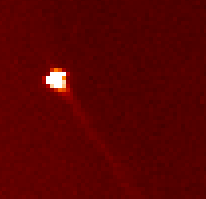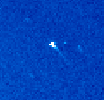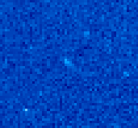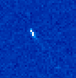

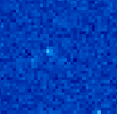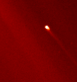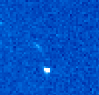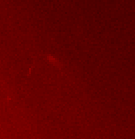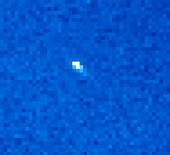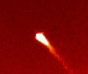

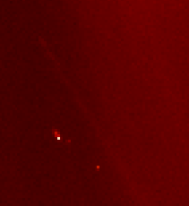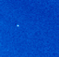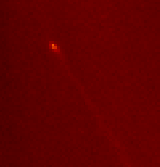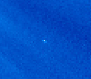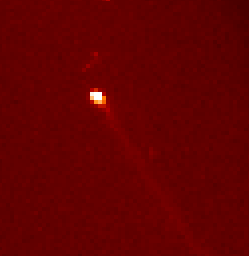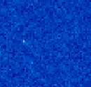

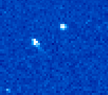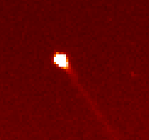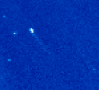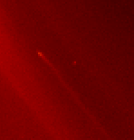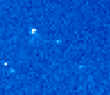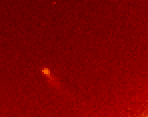

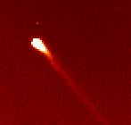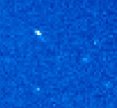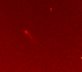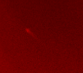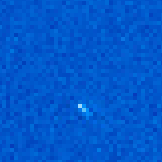
